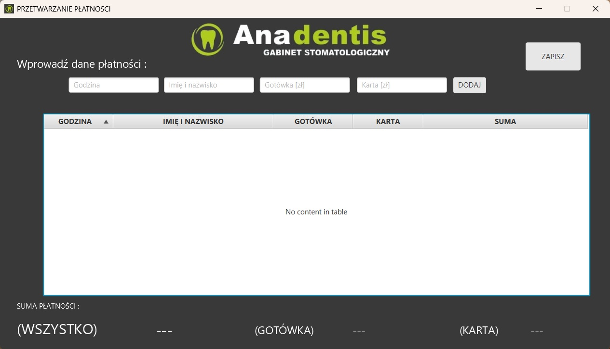
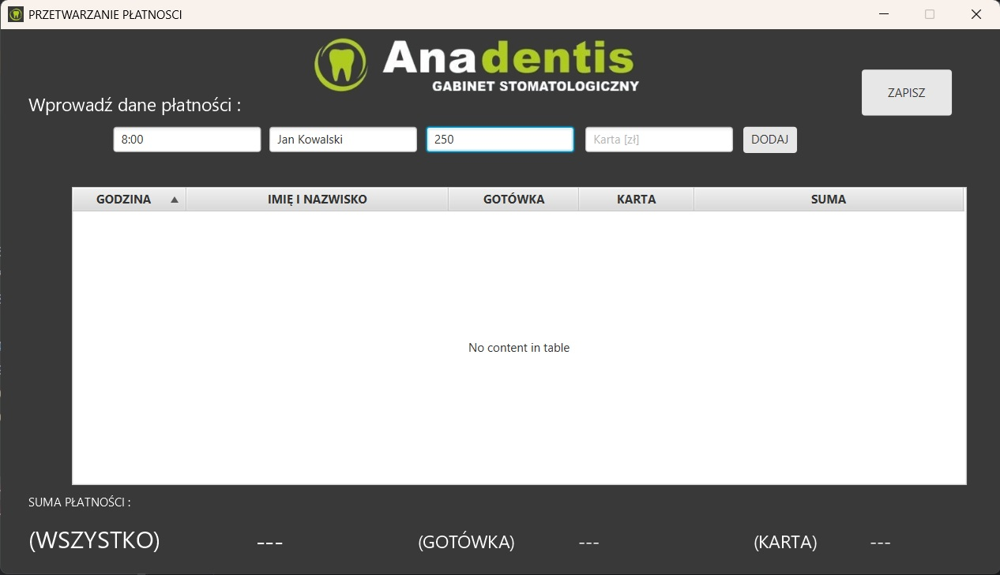
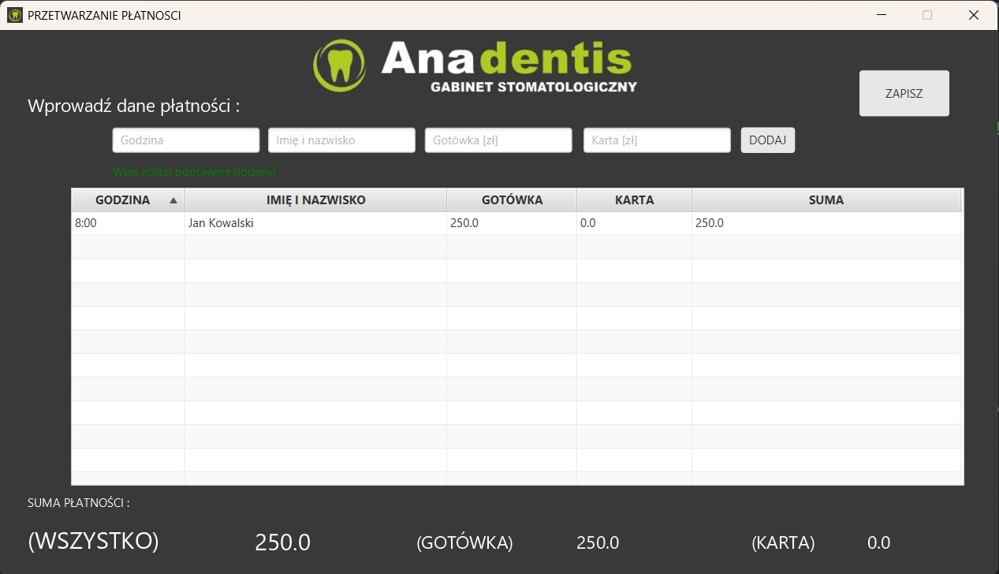
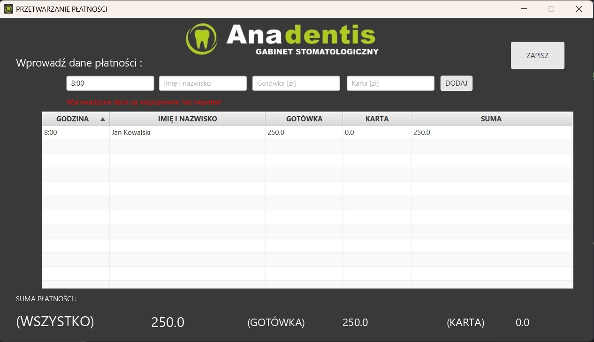
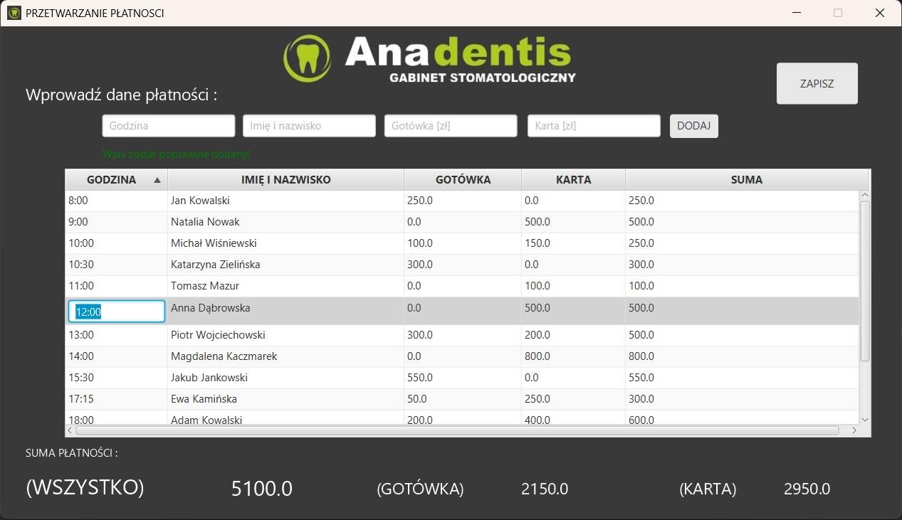
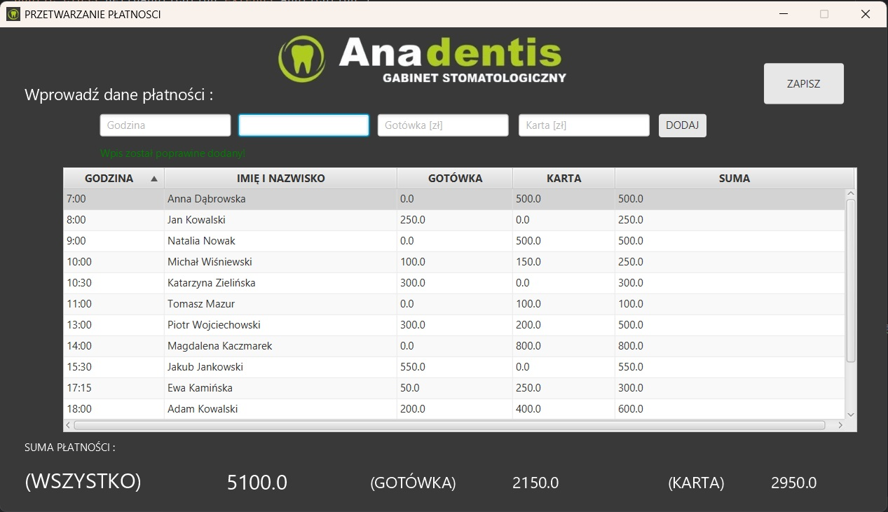
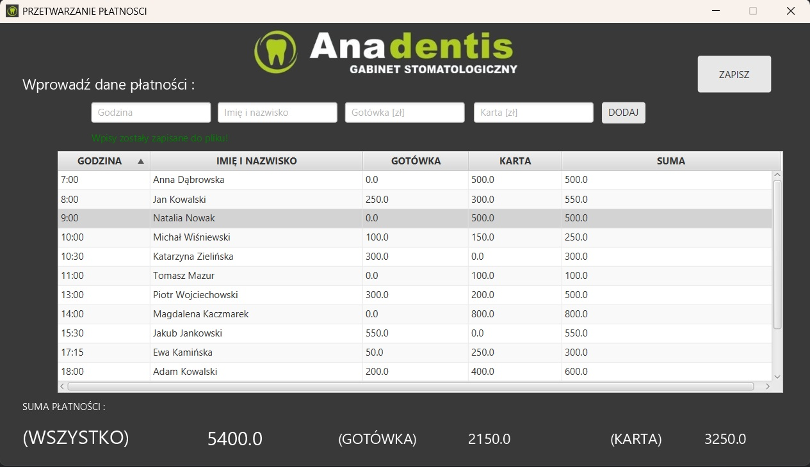
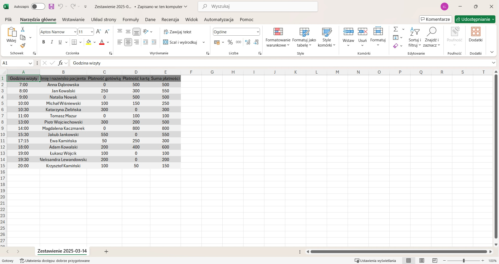
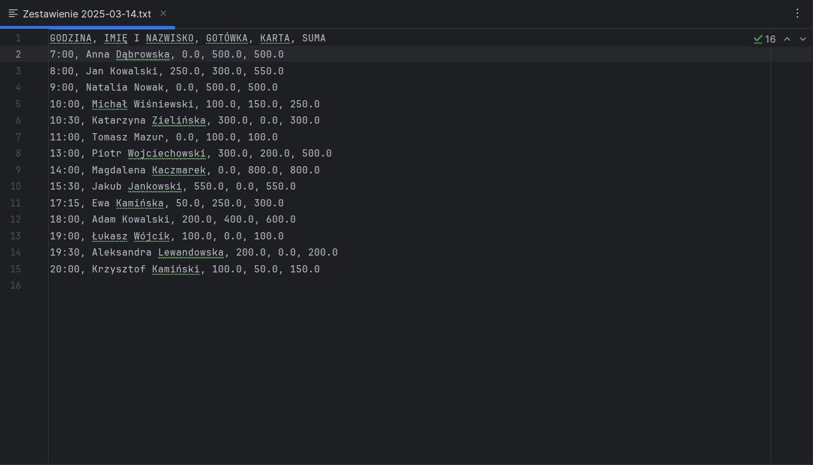

# PaymentApp
## DESCRIPTION
This is my own project to digitalize the process of saving payment details.
The application allows recording payment information for patients, including:
- Appointment date and time
- Patient's full name
- Cash payment amount
- Card payment amount

## Features
- Adding new payment entries
- Editing existing records
- Viewing payment history
- Calculating total amount for each payment type
- Saving data to a TXT file and an Excel file

## Requirements
### Java:
- **Java Runtime Environment (JRE)** version **1.8** or higher.
  - For running the application: JRE version **8** or newer.
  - For building or running in development mode: **Java Development Kit (JDK)** version **8** or newer.
### Dependencies:
  - [Maven](https://maven.apache.org/install.html)

### Additional Libraries:
- **JavaFX**

## Usage
1. Start the application.
   

2. Enter patient data and payment details.

  

 
3. Save the data to the database.

  

If you enter the wrong type of data or leave one of the required fields empty, an error will occur, and the data will not be saved.

  

If you made a mistake while entering the data, you can edit the entries (during editing, the entered data will also be validated for correctness).

  

Records are sorted by appointment hour, so the position of the record may change if you edit the time.

  

4. Save database to file. If the saving is successful, you will receive a notification.

  

Two files will be created: a TXT file and an Excel file. Each of them will be named "Zestawienie {today's_date}"

  
  

 
